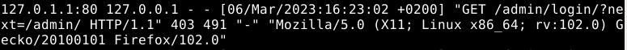
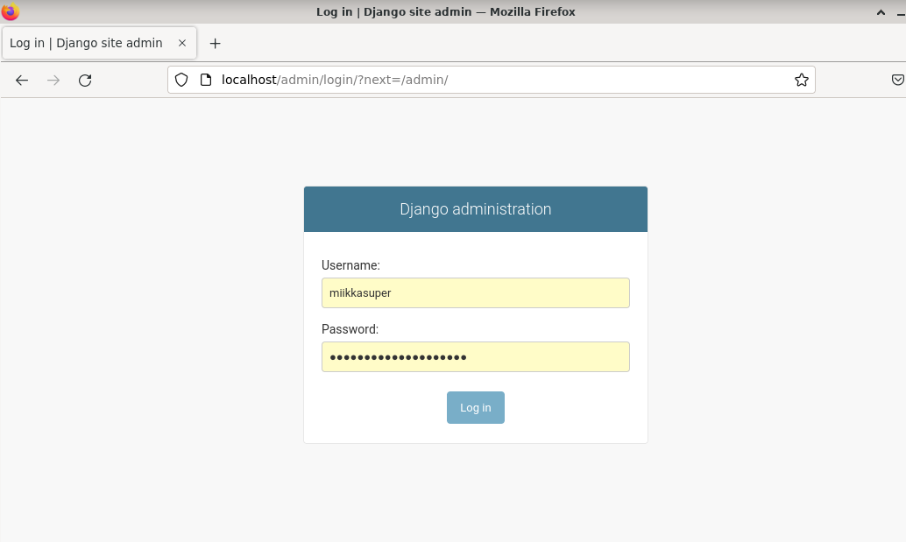

# h12 Tehtävä

## Kone

- Lenovo Y510P läppäri
- Suoritin: Intel(R) Core(TM) i7-4700MQ CPU @ 2.40GHz
- 8 GB RAM
- Windows 10, versio: 22H2

Aloitin tehtävän tekemisen ~10:30

Aloitin testaamalla lähtötilanteen 
- Käynnistin apachen serverin. 

      $ sudo systemctl start apache2

- Lähtötilanne: 

``http://localhost/admin/`` toimii  normaalisti


``http://localhost`` vastaa "Not Found", sillä ``DEBUG`` sivu on otettu pois päältä


## a) Kirjoitusvirhe Python-tiedostossa

Teen kirjoitusvirheen projektin ``settings.py`` tiedostoon


Miten oirelee serverillä verkossa:


- Kyseinen error ei kerro juuri mitään. Informoi pelkästään sisäisestä palvelinvirheestä

- Lähdin etsimään vikaa lokitiedostoista. Aloitin etsimisen Apachen error lokista.

      $ sudo tail -F /var/log/apache2/error.log

Listan kolme viimeistä riviä näyttävätkin errorin syyn. 


Error rivien rakenne ``[aikaleima]`` ``[wsgi:error]`` eli Web Server Gateway Interface virhe. ``[pid ....: tid .........]`` ymmärtäisin, että ``pid`` on prosessin tunniste ja ``tid`` on säikeen(thread) tunniste. [remote 127.0.0.1:58660] on osoite. Mielestäni tämä taitaa olla django-projektin palvelimen osoite.

Näiden jälkeen kullakin rivillä on tietoja errorista. 
- Ensimmäinen rivi kertoo tiedoston sekä sen tiedostopolun ja rivin missä errori on. 
- Toisella rivillä on edellä mainittu rivi kuvattuna, jossa virhe on ``STATIC_ROOT = .....``
- Kolmannella rivillä kuvataan virhe, joka edellisellä rivillä on kuvattuna eli ``NameError: name 'Os' is not defined``

Korjataan virhe ``settings.py`` kansiosta


Päivitetään projekti 

    $ touch mscom/wsgi.py

- Pävitetään selain


Django toimii taas.

## b) Django-projektikansio väärässä paikassa

- Siirrän Django-projektikansion ``mscom`` pois ``publicwsgi`` kansiosta käyttäjäni kotihakemistoon.

      $ cd publicwsgi/
      $ mv mscom/ /home/miikkas/
      


- Katsotaan miltä palvelin näyttää. 

      $ curl localhost/admin/  


"Forbidden" ei ole oikeutta käyttää tätä resurssia. 

- Katsotaan, mitä apachen error.log näyttää.

      $ sudo tail -F /var/log/apache2/error.log

- Error lokiin oli tullut uusi rivi:


a) kohdan virheestä eroten tässä on [authz_core:error], joka oletettavasti kertoo, että virhe liittyy oikeuksiin(authorization). Myös [client ::1:49390] eroaa a) kohdan virheilmoituksesta. Tässä client kuvaa virheen lähdettä, mutta loppuosasta en ole aivan varma. Yleensä kyseisessä kohdassa on IP-osoite.  

Virheilmoitus kertoo virheen olevan ``AH01630: client denied by server configuration: /home/miikkas/publicwsgi/mscom``. Errorin koodin ``AH01630`` avulla voisi lähteä selvittämään internetin välityksellä. Koska error antaa client denied päätin kuitenkin katsoa seuraavaksi Apachen access lokin.

- Apachen access.log ei näyttänyt mitään, joten katsoin saatavilla olevat apachen lokit

      $ cd /var/log/apache2/

Valitsin kansiossa olevan  lokitiedoston ``other_vhosts_access.log``, josta löysin tapahtumia.


Rivi kuitenkin kertoi vain, että on tehty GET pyyntö /admin/ päätteeseen ja palvelin on vastannut 403 errorilla eli tämä ei juurikaan hyödyttänyt.

Päätin palata apachen error lokiin uudestaan, kopioida tiedostopolun ja syöttää sen komentokehotteeseen.

    $ ls /home/miikkas/publicwsgi/mscom
    
Pyyntö vastasi ``ls: cannot access '/home/miikkas/publicwsgi/mscom': No such file or directory``, katsoin vielä ``publicwsgi`` kansion menemällä kansioon ``$ cd publicwsgi/`` ja sen jälkeen listaamalla sisällön ``$ ls``
- Kansiota ei siis ole ollenkaan kyseisessä kansiossa.
- Siirryin /home hakemistoon ```$ cd /home``
- Etsin ``mscom`` tiedostoa 

      $ find|grep mscom
      
      
      
- Listalta löytyi heti oikea tiedostopolku, josta käy ilmi, että Django-projektin tiedosto on käyttäjän ``miikkas`` kotihakemistossa
  - Siirretään kansio ``publicwsgi`` kansioon
        
        $ mv mscom/ /home/miikkas/publicwsgi/
        
- Katsotaan selaimesta toimiiko http://localhost/admin/


Toimii!

## c) Projektikansiolla väärät oikeudet

- Aloitus: 
            $ cd publicwsgi
            $ chmod ugo-rwx mscom/

- Testataan palvelimen vastaus: ``$ curl localhostadmin/``


- 403 Forbidden Errori. Virhe kertoo, ettei minulla ole oikeuksia tämän sisällön käyttöön.
- Tsekataan apachen error loki. ``sudo tail -F /var/log/apache2/error.log``

Seuraava errori löytyi:


Error ``[aikaleima]`` ``[core:error(virheen tyyppi)]`` ``[pid aj tid]`` .... ``[client ::1:38158(osoite)]``

Errori kertoo, että clientiltä on oikeudet evätty: ``AH0035: access to /admin/ denied``, koska tiedoston hakemiseen vaadittavat oikeudet puuttuvat tiedostopolun komponentista.  

- Kopioin tiedostopolun ja yritin siirtyä tiedostoon. Yritin myös listata tiedoston.

            $ cd /home/miikkas/publicwsgi/mscom/mscom
            $ ls /home/miikkas/publicwsgi/mscom/mscom
            
- Kumpikin komento antoi saman vastauksen "Permission denied" eli minulla ei ole oikeutta tiedostoihin. 
- Apachen access.log antoi seuraavan virheilmoituksen: 



Errorin analysointi:
- Virheilmoituksen alussa on osoite, johon pyyntö tehdään, jonka jälkeen on pyynnön tekijän IP:osoite seekä tunniste, joka on tässä tapauksessa ``-``.
- [aikaleima]
- Pyyntö ``"GET /admin/login/?next=/admin/ HTTP/1.1`` eli mihin pyyntö on tehty. 
- ``403`` on errorin koodi eli tässä tapauksessa Forbidden ja ``491`` on vastauksen paketin koko. 
- ``"-"`` Tässä pitäisi mielestäni olla tunniste. 
- ``"Mozilla/5.0....`` on selaimen sekä selaimen käyttöjärjestelmän tietoja, joilla pyyntö on tehty.

Tästä ilmoituksesta saa tiedon, että käyttäjä(tässä tapauksessa minä) olen tehnyt pyynnön palvelimelle, mutta palvelin on vastannut virheellä 403.

Tsekkasin vielä apachen serverin statuksen, jossa oli kaikki kunnossa, sekä tein vielä config testin, jossa kaikki oli myös kunnossa.

- Korjataan virhe. Sama komento, mutta nyt - tilalle vaihdetaan +, jolloin komento lisää oikeudet, jotka aikaisemmin poistimme.
- Eli:

              $ chmod ugo+rwx mscom/

- Tämän jälkeen päivitin apachen palvelimen ``$ sudo systemctl restart apache2``. 
- Testasin selaimessa toimiiko tuotantopalvelin ``http://localhost/admin/``



Toimii!

## d) Kirjoitusvirhe Apachen asetustiedostossa 

Muokataan apachen asetustiedostoa ``$ sudoedit /etc/apache2/sites-available/mscom.conf``

Verkkoselain vastaus: 


Nyt palvelin ei vastaa ollenkaan.
- Tarkistetaan Apache serverin status

      $ sudo systemctl status apache2


Apachen serveri on kaatunut ja sen tila on failed. Serverin tilan alla listassa näkyy aikaleiman perässä ``apachectl[3012]: apache2: Syntax error on line 225 of...``, joka kertoo, että syntaksissa on virhe. Vihreen näkee suoraan siirtämällä listan riviä oikealle nuolinäppäimellä, mutta selkeyden vuoksi tarkastan syntaksin config testillä.

    $ /sbin/apache2ctl configtest
    


Configtest kertoo suoraan, että apachen asetustiedostossa on Syntaksivirhe rivillä 8 tiedostossa /etc/apache2/sites-enabled/mscom.conf. ``<VirtualHost> was not closed`` on kyseinen virhe ja lopussa on vielä ``Action 'configtest' failed`` eli testi ei mennyt läpi. Lopussa lukee, että apachen error lokista löytyisi mahdollisesti lisää tietoa. Kävin tsekkaamassa sen vielä, vaikka errori jo selvisikin. 

Error lokissa oli vain ``AH00491: caught SIGTERM, shutting down``, joka käytännössä kertoo vain, että apachen palvelin on pysähtynyt.

- Käydään korjaamassa virhe 

      $ sudoedit /etc/apache2/sites-available/mscom.conf
      


- Tämän jälkeen käynnistin apachen palvelimen uudelleen

      $ sudo systemctl restart apache2
      
- Pävitetään selain


Palvelin pelaa jälleen!

## e)  Apachen WSGI-moduli puuttuu

Poistin Apachen WSGI-moduulin ``$ sudo apt-get purge libapache2-mod-wsgi-py3``

Verkkoselaimen vastaus:


Palvelin ei vastaa ollenkaan.

Tsekataan palvelimen status ``$ sudo systemctl status apache2``


Palvelin vastasi ``failed`` eli se on kaatunut. 

Syntaksissa näyttäisi taas olevan vikaan, joten ajetaan ``$ /sbin/apache2ctl configtest``

``AH00526:`` Virhe, joka kertoo, että ``mscom.conf`` tiedostossa on syntaksivirhe. ``Invalid command 'WSGIDaemonProcess', perhaps misspelled or defined by module not included in the server configuration`` Kertoo meille, että WSGIDaemonProcess on kirjoitettu väärin tiedostossa tai että se puuttuu kokonaan serverin konfiguraatiosta. 

Error loki tarjosi meille jälleen ``SIGTERM`` eli palvelin on pysähtynyt.

- Siirryin tarkastelemaan ``mscom.conf`` tiedostoa. ``$ micro /etc//etc/apache2/sites-available/mscom.conf``
  - Tiedostossa on määritelty muuttujia, jotka ohjaavat määritelmät oikeisiin paikkoihin. ``WSGIDaemonProcess`` sisältää muuttujat ``TUSER``, ``TDIR`` ja ``TVENV``
      - TDIR johtaa projektikansioon. Siinä tuskin on mitäänvikaa
      - TUSER määrittelee käyttäjän, joka on oikein teidostossa
      - Jäljelle jää TVENV, jossa on määritelty tiedostopolku ``/home/miikkas/publicwsgi/env/lib/python3.9/site-packages``  
  - Päätin ensin testata toimiiko Django omalla kehityspalvelimellaan.
    - Siirryin virtuaaliympäristöön ``$ cd publicwsgi/`` ja ``$ source env/bin/activate`` 
    - ``$ cd mscom/``
    - ``$ ./manage.py runserver``
  


Kehityspalvelin vastasi errorilla ``Bad Request (400)``. 
- Muistin, että settings.py tiedostossa on määritelty ``ALLOWED_HOSTS = ["localhost"]``, eli kehityspalvelimen URL toimii ``http://localhost:8000``.
      - Testasin avata kehityspalvelimen ``http://localhost:8000`` ja kehityspalvelin toimi normaalisti.

### Tehtävien tekeminen veikin odotettua kauemmin aikaa, joten palautan tehtävän tässä välissä ja teen sen loppuun myöhemmin. ~13:55

### Jatkoin ~14:45

- Päätin palata tutkimaan tiedostopolkua ``/home/miikkas/publicwsgi/env/lib/python3.9/site-packages``

            $ ls /home/miikkas/publicwsgi/env/lib/python3.9/site-packages


- ``site-packages`` listalta ei löydy ollenkaan mitään pakettia nimellä WSGI tai mitään siihen liittyvää.
- Tässä vaiheessa päätin stopata vianselvityksen ja asentaa paketin uudelleen.

            $ sudo apt-get -y install libapache2-mod-wsgi-py3

- $ touch msdb/wsgi.py    
- sudo systemctl restart apache2
- Selaimen päivitys 


Projekti toimii jälleen.

Tämä kohta jäi itselle hieman epäselväksi, ehkä nopeiten olisi löytänyt suoraan googlettamalla ``WSGIDaemonProcess`` tai errorin: ``Invalid command 'WSGIDaemonProcess', perhaps misspelled or defined by module not included in the server configuration``, joka olisi johdattanut ``mod_wsgi``:n jäljille.


## f) Väärät domain-nimet ALLOWED_HOSTS-kohdassa

- Avasin tuotantopalvelimen ``http://localhost/admin/`` palvelin vastasi Bad Request (400).
- Error lokista ei löytynyt mitään, myöskään access lokista ei löytynyt mitään hyödyllistä. Apachen status oli myös kunnossa kuten myös config testi
- Päätin laittaa Apachen pois päältä ``$ sudo systemctl stop apache2`` ja siirtyä selvittämään vikaa Djangon omalle kehityspalvelimelle DEBUG:n avulla.
      - Siirryin virtuaaliympäristöön ``$ cd publicwsgi/`` ja ``$ source env/bin/activate`` 
      - ``$ cd mscom/``
      - ``$ ./manage.py runserver``
      - Eli käynnistin tässä kehityspalvelimen, joka ei siis pyöri apachen kautta.
      - Avasin kehityspalvelimen ``http://localhost/admin/``, koska olen laittanut ``localhost``:n ALLOWED_HOST:n sisään.  
  


Kehityspalvelin vastasi errorilla ``Bad Request (400)``. 
- Latoin DEBUG:n päälle mscom/settings.py --> DEBUG=False --> DEBUG=True
- $ touch wsgi,py


DEBUG Näyttää suoraan missä vika eli väärä HTTP_HOST header:'localhost'. ``localhost`` pitäisi lisätä ``ALLOWED_HOSTS`` kohtaan.
- Menin katsomaan ``settings.py`` tiedoston, ``$ micro settings.py``.


- localhost oli kirjoitettu väärin --> muokkasin kohdan oikeaksi eli

            ALLOWED_HOSTS = ["localhost"]
            
- Tallennus, jonka jälkeen ``$ touch wsgi.py``
- Testataan, että kehityspalvelin toimii ``$ curl http://localhost:8000``


Toimii!

Seuraavaksi kehityspalvelin kiinni.
- DEBUG pois päältä eli mscom/settings.py --> DEBUG=True --> DEBUG=False
- Projektin päivitys ``$ touch wsgi.py``
- Apache takaisin päälle ``$ sudo systemctl start apache2``


Nyt tuotantopalvelin on jälleen käytössä ja DEBUG pois päältä.

Lopetin tehtävien tekemisen ~17:20

## Lähteet

Karvinen Tero 2023, h12 vianselvity, Luettavissa: https://terokarvinen.com/2023/linux-palvelimet-2023-alkukevat/#h12-vianselvitys
