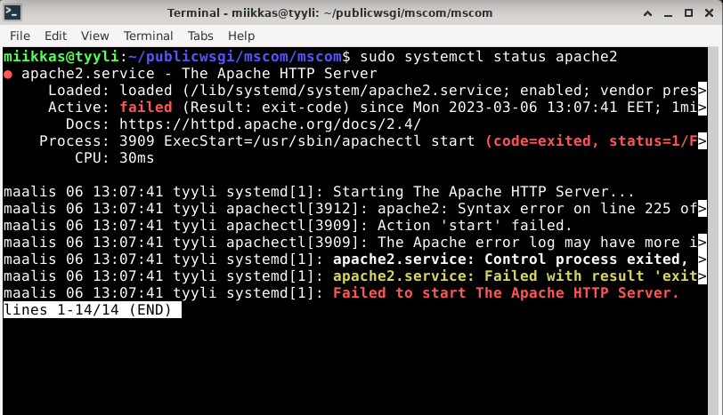

# h12 Tehtävä

## Kone

- Lenovo Y510P läppäri
- Suoritin: Intel(R) Core(TM) i7-4700MQ CPU @ 2.40GHz
- 8 GB RAM
- Windows 10, versio: 22H2

Aloitin tehtävän tekemisen ~10:30

Aloitin testaamalla lähtötilanteen 
- Käynnistin apachen serverin. 

      $ sudo systemctl start apache2

- Lähtötilanne: 

``http://localhost/admin/`` toimii  normaalisti


``http://localhost`` vastaa "Not Found", sillä ``DEBUG`` sivu on otettu pois päältä


## a) Kirjoitusvirhe Python-tiedostossa

Teen kirjoitusvirheen projektin ``settings.py`` tiedostoon


Miten oirelee serverillä verkossa:


- Kyseinen error ei kerro juuri mitään. Informoi pelkästään sisäisestä palvelinvirheestä

- Lähdin etsimään vikaa lokitiedostoista. Aloitin etsimisen Apachen error lokista.

      $ sudo tail -F /var/log/apache2/error.log

Listan kolme viimeistä riviä näyttävätkin errorin syyn. 


Error rivien rakenne ``[aikaleima]`` ``[wsgi:error]`` eli Web Server Gateway Interface virhe. ``[pid ....: tid .........]`` ymmärtäisin, että ``pid`` on prosessin tunniste ja ``tid`` on säikeen(thread) tunniste. [remote 127.0.0.1:58660] on osoite. Mielestäni tämä taitaa olla django-projektin palvelimen osoite.

Näiden jälkeen kullakin rivillä on tietoja errorista. 
- Ensimmäinen rivi kertoo tiedoston sekä sen tiedostopolun ja rivin missä errori on. 
- Toisella rivillä on edellä mainittu rivi kuvattuna, jossa virhe on ``STATIC_ROOT = .....``
- Kolmannella rivillä kuvataan virhe, joka edellisellä rivillä on kuvattuna eli ``NameError: name 'Os' is not defined``

Korjataan virhe ``settings.py`` kansiosta


Päivitetään projekti 

    $ touch mscom/wsgi.py

- Pävitetään selain


Django toimii taas.

## b) Django-projektikansio väärässä paikassa

- Siirrän Django-projektikansion ``mscom`` pois ``publicwsgi`` kansiosta käyttäjäni kotihakemistoon.

      $ cd publicwsgi/
      $ mv mscom/ /home/miikkas/
      


- Katsotaan miltä palvelin näyttää. 

      $ curl localhost/admin/  


"Forbidden" ei ole oikeutta käyttää tätä resurssia. 

- Katsotaan, mitä apachen error.log näyttää.

      $ sudo tail -F /var/log/apache2/error.log

- Error lokiin oli tullut uusi rivi:


a) kohdan virheestä eroten tässä on [authz_core:error], joka oletettavasti kertoo, että virhe liittyy oikeuksiin(authorization). Myös [client ::1:49390] eroaa a) kohdan virheilmoituksesta. Tässä client kuvaa virheen lähdettä, mutta loppuosasta en ole aivan varma. Yleensä kyseisessä kohdassa on IP-osoite.  

Virheilmoitus kertoo virheen olevan ``AH01630: client denied by server configuration: /home/miikkas/publicwsgi/mscom``. Errorin koodin ``AH01630`` avulla voisi lähteä selvittämään internetin välityksellä, mutta koska error antaa client denied päätin katsoa seuraavaksi Apachen access lokin.

- Apachen access.log ei näyttänyt mitään, joten katsoin saatavilla oelvat apachen lokit

      $ cd /var/log/apache2/

Valitsin kansiossa olevan  lokitiedoston ``other_vhosts_access.log``, josta löysin tapahtumia.


Rivi kuitenkin kertoi vain, että on tehty GET pyyntö /admin/ päätteeseen ja palvelin on vastannut 403 errorilla eli tämä ei juurikaan hyödyttänyt.

Päätin palata apachen error lokiin uudestaan, kopioida tiedostopolun ja syöttää sen komentokehotteeseen.

    $ ls /home/miikkas/publicwsgi/mscom
    
Pyyntö vastasi ``ls: cannot access '/home/miikkas/publicwsgi/mscom': No such file or directory``, katsoin vielä ``publicwsgi`` kansion menemällä kansioon ``$ cd publicwsgi/`` ja sen jälkeen listaamalla sisällön ``$ ls``
- Kansiota ei siis ole ollenkaan kyseisessä kansiossa.
- Siirryin /home hakemistoon ```$ cd /home``
- Etsin ``mscom`` tiedostoa 

      $ find|grep mscom
      
      
      
- Listalta löytyi heti oikea tiedostopolku, josta käy ilmi, että Django-projektin tiedosto on käyttäjän ``miikkas`` kotihakemistossa
  - Siirretään kansio ``publicwsgi`` kansioon
        
        $ mv mscom/ /home/miikkas/publicwsgi/
        
- Katsotaan selaimesta toimiiko http://localhost/admin/


Toimii!

## c) Projektikansiolla väärät oikeudet

## d) Kirjoitusvirhe Apachen asetustiedostossa 

Muokataan apachen asetustiedostoa ``$ sudoedit /etc/apache2/sites-available/mscom.conf``

Verkkoselain vastaus: 


Nyt palvelin ei vastaa ollenkaan.
- Tarkistetaan Apache serverin status

      $ sudo systemctl status apache2



Apachen serveri on kaatunut ja sen tila on failed. Serverin tilan alla listassa näkyy aikaleiman perässä ``apachectl[3012]: apache2: Syntax error on line 225 of...``, joka kertoo, että syntaksissa on virhe. Vihreen näkee suoraan siirtämällä listan riviä oikealle nuolinäppäimellä, mutta selkeyden vuoksi tarkastan syntaksin config testillä.

    $ /sbin/apache2ctl configtest
    


Configtest kertoo suoraan, että apachen asetustiedostossa on Syntaksivirhe rivillä 8 tiedostossa /etc/apache2/sites-enabled/mscom.conf. ``<VirtualHost> was not closed`` on kyseinen virhe ja lopussa on vielä ``Action 'configtest' failed`` eli testi ei mennyt läpi. Lopussa lukee, että apachen error lokista löytyisi mahdollisesti lisää tietoa. Kävin tsekkaamassa sen vielä, vaikka errori jo selvisikin. Error lokissa oli vain ``AH00491: caught SIGTERM, shutting down``, joka käytännössä kertoo vain, että apachen palvelin on pysähtynyt.

- Käydään korjaamassa virhe 

      $ sudoedit /etc/apache2/sites-available/mscom.conf
      


- Tämän jälkeen käynnistin apachen palvelimen uudelleen

      $ sudo systemctl restart apache2
      
- Pävitetään selain


Palvelin pelaa jälleen!

## e)  Apachen WSGI-moduli puuttuu

Poistin Apachen WSGI-moduulin ``$ sudo apt-get purge libapache2-mod-wsgi-py3``

Verkkoselaimen vastaus:


Palvelin ei vastaa ollenkaan.

Tsekataan palvelimen status ``$ sudo systemctl status apache2``


Palvelin vastasi ``failed`` eli se on kaatunut. 

Syntaksissa näyttäisi taas olevan vikaan, joten ajetaan ``$ /sbin/apache2ctl configtest``

``AH00526:`` Virhe, joka kertoo, että ``mscom.conf`` tiedostossa on syntaksivirhe. ``Invalid command 'WSGIDaemonProcess', perhaps misspelled or defined by module not included in the server configuration`` Kertoo meille, ettei WSGIDaemonProcess pelaa tiedostossa. Error loki tarjosi meille jälleen ``SIGTERM`` eli palvelin on pysähtynyt.

- Siirryin tarkastelemaan ``mscom.conf`` tiedostoa. ``$ micro /etc//etc/apache2/sites-available/mscom.conf``
  - Tiedostossa on määritelty muuttujia, jotka ohjaavat määritelmät oikeisiin paikkoihin. ``WSGIDaemonProcess`` sisältää pelkästään ``USER`` muuttujan eli siinä tuskin on vikaa. Tämän alla on kuitenkin ``WSGIScriptAlias / ${WSGI}``, jossa on WSGI muuttuja. Muuttuja on määritelty osoittamaan tiedostoon ``wsgi.py``, joka on tiedostopolussa ``/home/miikkas/publicwsgi/mscom/mscom/wsgi.py``
  - Siirryin tiedostoon, mutta tiedostossa oli kaikki kunnossa. 
  - Päätin testata toimiiko Django omalla kehityspalvelimellaan.
    - Siirryin virtuaaliympäristöön ``$ cd publicwsgi/`` ja ``$ source env/bin/activate`` 
    - ``$ cd mscom/``
    - ``$ ./manage.py runserver``
  


Kehityspalvelin vastasi myös errorilla ``Bad Request (400)``. 
- Muistin, että settings.py tiedostossa on määritelty ``ALLOWED_HOSTS = ["localhost"]``, eli kehityspalvelimen URL toimii ``http://localhost:8000`` eli kehityspalvelin toimii normaalisti.

### Tehtävien tekeminen veikin odotettua kauemmin aikaa, joten palautan tehtävän tässä välissä ja teen sen loppuun myöhemmin. ~13:55


## f) Väärät domain-nimet ALLOWED_HOSTS-kohdassa
